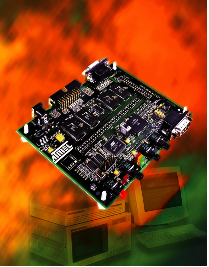

# AT91EB01 Sample project

* [About the sample project](#about)
* [Configuration](#cfg)
* [Building and running the project](#run)

<a id="about"></a>
## About the sample project

### The target

The project uses a legacy AT91EB01 board with a AT91M40400 microcontroller (arm7tdmi microprocessor @ 32.768 MHz) and 512kb SRAM and 128kb Flash. It requires a JLINK compatible JTAG probe.

<p align="center"></p>

The project allows you to upload the program in SRAM, not Flash. Openocd doesn't have the driver for the Flash. So you have to use an external tool to download to flash (might have been done by ATMEL, but doesn't worth the effort for now). Some notes about memory configuration and system boot.

### Memory configuration

```
Flash Memory : AT29LV1024 (64K x 16)
               base address defined in EBI (EBI_CSR0)
* lower mem : 128Kb @ 0x01000000 up to 0x0101FFFF
* upper mem :  64Kb @ 0x01010000 up to 0x0101FFFF

Internal SRAM : 4Kb @ 0x00300000

External SRAM : 512Kb @ 0x02000000
                base address defined in EBI (EBI_CSR1)

Config EBI (External BUS Interface)

mdw 0xFFE00000 10

EBI_CSR0 0xffe00000: 0x01002535 [External Flash Memory] 
                     0b00|1|0|010|10|0|1|101|01,
                     b[13]=1 : chip select enabled,
                     b[12]=0 : byte write access type,
                     b[11-9]=010 : 2 cycles added after transfer,
                     b[8-7]=10 : 16Mbytes page size,
                     b[5]=1 : wait state generation enabled,
                     b[4-2]=101, 6 wait states, 
                     b[1-0]=01 : 16bits data bus.
EBI_CSR1 0xffe00004: 0x02002121 [External SRAM Memory]
                     0b00|1|0|000|10|0|1|000|01,
                     b[13]=1 : chip select enabled,
                     b[12]=0 : byte write access type,
                     b[11-9]=000 : 0 cycles added after transfer,
                     b[8-7]=10 : 16Mbytes page size,
                     b[5]=1 : wait state generation enabled,
                     b[4-2]=000, 1 wait state, 
                     b[1-0]=01 : 16bits data bus.
EBI_CSR2 0xffe00008: 0x20000000 [Not Used]
EBI_CSR3 0xffe0000C: 0x30000000 [Not Used]
EBI_CSR4 0xffe00010: 0x40000000 [Not Used]
EBI_CSR5 0xffe00014: 0x50000000 [Not Used]
EBI_CSR6 0xffe00018: 0x60000000 [Not Used]
EBI_CSR7 0xffe0001C: 0x70000000 [Not Used]
EBI_RCR  0xffe00020: 0x00000000 [Remap Control Register -- WOnly]
EBI_MCR  0xffe00024: 0x00000006 [Memory Control Register MCR]
```

Testing the memory: in a terminal at project root

```
ocd&
```

Reset and halt the target and send the these to openocd to test communication:

```
#read memory
mdw 0x02000000 4
	
#write memory
mww 0x02000000 1

#disassemble
arm disassemble 0x300000 20
```

### System BOOT

The LK3 surface mount link connects the P24/BMS chip pin to the ground, and so
selects booting from the external flash memory.

At boot time, the Flash memory (Chip selct 0) is then mapped at adress 0 to
boot from it. Internal SRAM memory can be accessed from address 0x00300000 (4k).

Writing 0x1 in EBI_RCR register allows to remap the internal RAM at adress 0, 
and to remap Flash memory according to the EBI_CSR0 register.

==> At startup,

* configure the External Bus Interface (Chip Selects and MCR).
* write 0x1 to EBI_RCR to remap internal SRAM and the external Flash (can't go back!).
* load the vector table in the internal SRAM.
* load initialize hardware and call the `main` function.

	Note that if the 

### Project tree

```
 +- config/            linker script, openocd script
 +- docs/              some doc
 +- include/
 |   +- board.h        global peripheral pointers
 |   +- AT91M40400.h  peripheral register structure definition
 +- lib/               microcontroller peripheral drivers
 +- src/               Application src
 +- startup/           Startup code ()
 +- Makefile
 +- README.md
```

<a id="cfg"></a>
## Project configuration (if needed)

The project is managed with a Makefile. The developper needs only to focus on
the first part of the Makefile.


 
<a id="run"></a>
## Build an run the project

### Connecting to the board

	ocd &
	
then choose the at91eb01.cfg target in the list.
sudo apt install g
### Building the project:

	make

will produce the executable `main.elf`, a mapping file `main.elf.map` and object files in the different directories where there is source code.

### Cleaning the project:

	make clean

### Uploading the program to the microcontroller:

	dbg main.elf &

uploads the program to the microcontroller FLASH memory, and 
executes the code up to the entry `main()` function.

`dbg` has a restart feature (see second icon from the left) which enable to
restart the program without re-flashing (interesting while debugging).

`dbg` has an autreload feature that tracks for executable change. If on, it 
reloads automatically the new executable so that you don't need to relaunch
it each time.

	# query autoreload
	set autoreload
	
	# set autoreload
	set autoreload 1
	
	# unset autoreload
	set autoreload 0

A serial terminal is required to test USART example 5

A few options are

* `gtkterm`

	```
	sudo apt install gtkterm
	gtkterm
	```
	
	then configure the port `/dev/USB0`, the speed 115200 bauds, 8 bits, no parity, 1 stop bit

* GNU screen

	```
	sudo apt install screen

	screen /dev/ttyUSB0 115200

	# Enable the CTS/RTS handshake
	screen /dev/ttyUSB0 115200,ctsrts

	# Close the screen after you finish the debugging session
	--> Ctrl a + k

	# View your serial port status (CTS/RTS/DTS/PE/RI..etc)
	--> Ctrl a + i
	
	# clear the buffer : Ctl a + C
	# enter command    : Ctl a + :
  		- clear : clear the buffer
	```
